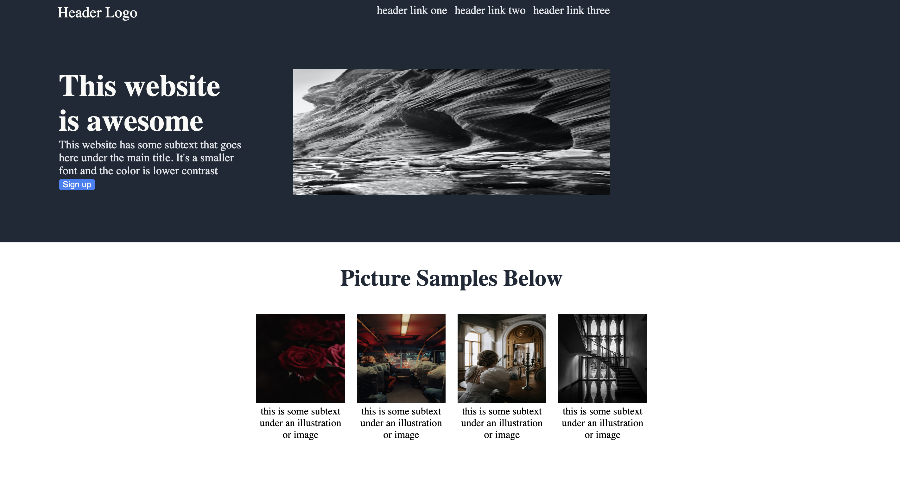

# My-First-Project
This is my first project in HTML/CSS

I created a landing page using just html and css

Recreated this from a picture sample

Used pictures from Cine Insomnia, Rina Mayer, Kien Tran, Bade Saba and Robert Schrader on [pexels.com](https://www.pexels.com/)

Live Demo:
https://prosperjohn9.github.io/landing-page/

Desktop View:

This project was created for the Landing Page assignment as part of The Odin Project curriculum.

# Provided Assets
Project Design File: [landing-page.png](https://cdn.statically.io/gh/TheOdinProject/curriculum/81a5d553f4073e593d23a6ab00d50eef8620796d/foundations/html_css/project/imgs/01.png)

Colors and Fonts: [colors-and-fonts.png](https://cdn.statically.io/gh/TheOdinProject/curriculum/81a5d553f4073e593d23a6ab00d50eef8620796d/foundations/html_css/project/imgs/02.png)

# Objectives
Build a page based on the Provided Assets